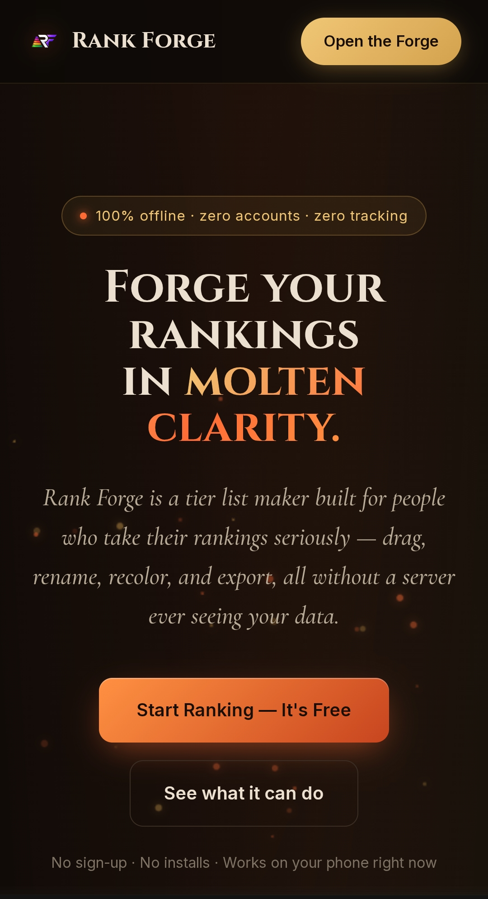
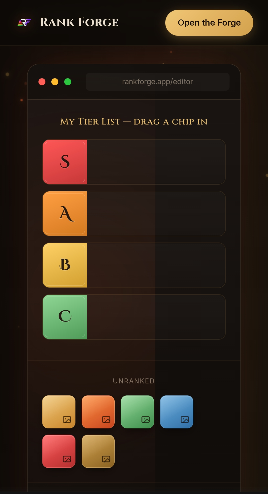
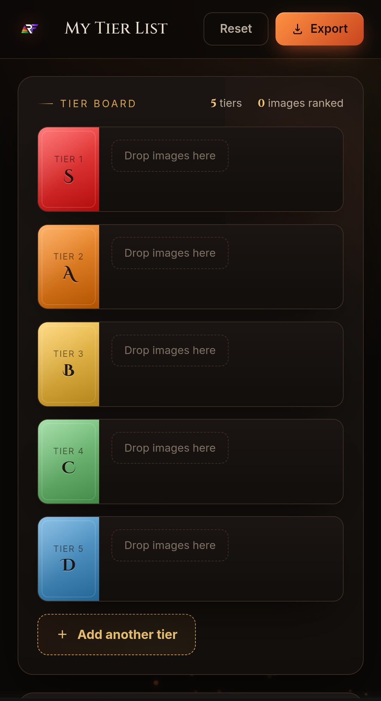
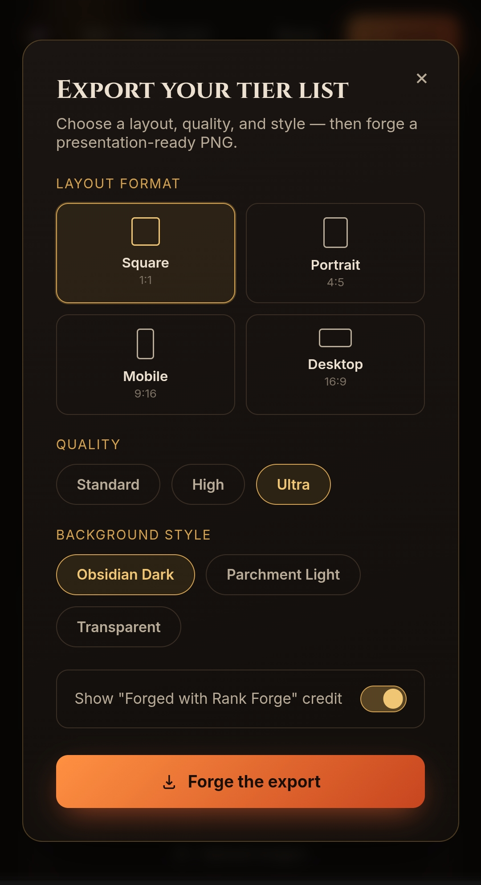
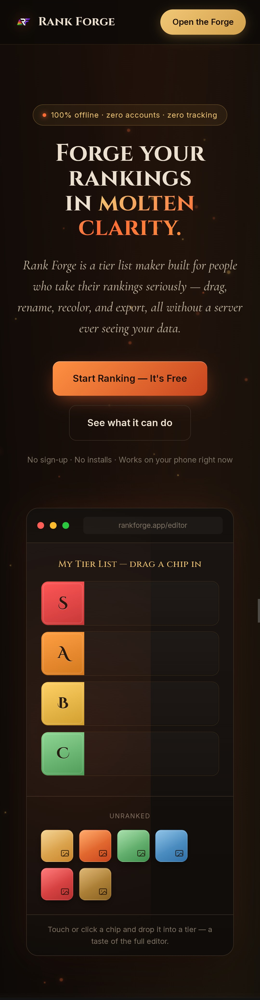

<div align="center">


# Rank Forge

**Forge your rankings in molten clarity.**

A privacy-first, offline-capable tier list maker — no accounts, no servers, no tracking.
Built entirely with vanilla HTML, CSS, and JavaScript.

[](LICENSE)
[]()
[]()
[]()

[Live Demo](https://ocvshanto.github.io/rank-forge/) · [Report a Bug](../../issues) · [Request a Feature](../../issues)

</div>

---

## ✨ What is Rank Forge?

Rank Forge is a tier list maker built for people who take their rankings seriously. Upload images, drag them into fully customizable tiers, and export a presentation-ready PNG — all without a single byte ever leaving your device. There's no backend, no database, and no account system: your rankings live only in your browser.

## 📸 Screenshots

<table>
  <tr>
    <td width="50%"></td>
    <td width="50%"></td>
  </tr>
  <tr>
    <td align="center"><sub><b>Landing page hero</b></sub></td>
    <td align="center"><sub><b>Interactive live demo preview</b></sub></td>
  </tr>
  <tr>
    <td width="50%"></td>
    <td width="50%"></td>
  </tr>
  <tr>
    <td align="center"><sub><b>The editor — tier board & unranked pool</b></sub></td>
    <td align="center"><sub><b>Export modal — format, quality, background & watermark</b></sub></td>
  </tr>
</table>

<p align="center"></p>
<p align="center"><sub><b>Full landing page</b></sub></p>

## 🔑 Features

- **Unlimited, fully editable tiers** — add, rename, recolor, reorder, collapse, or delete tiers. Nothing is hard-coded to S–F.
- **Click-to-edit tier popover** — click any tier plate to rename it, change its color from presets or a custom picker, reorder it, or delete it.
- **Drag-and-drop image upload** — drop a folder of images straight onto the canvas, or pick them the usual way.
- **Unified drag system for mouse and touch** — long-press to lift an image on mobile, auto-scroll near screen edges, and smooth pointer-based dragging on desktop.
- **On-device image compression** — uploads are automatically resized and compressed before storage, so you can rank far more images without hitting browser storage limits.
- **IndexedDB-backed storage** — images and tier data persist locally between sessions, well beyond what `localStorage` alone allows.
- **Presentation-ready exports** — choose a layout format (Square, Portrait, Mobile Story, or Desktop Widescreen), quality tier, background style (Obsidian Dark, Parchment Light, or Transparent), and an optional watermark credit, then export a clean PNG.
- **Zero accounts, zero tracking** — everything runs client-side. There is no backend for your data to pass through.

## 🛠️ Tech Stack

Rank Forge is intentionally dependency-free:

- **HTML5, CSS3, vanilla JavaScript** — no React, Vue, Angular, Bootstrap, Tailwind, or jQuery
- **No build step** — no bundler, no package manager, no compiler
- **No backend** — a fully static site that runs by opening `index.html` in a browser

## 🚀 Getting Started

**Option 1 — Just open it**

Clone or download this repository, then open `index.html` in any modern browser. That's it.

```bash
git clone https://github.com/ocvSHANTO/rank-forge.git
cd rank-forge
open index.html   # or double-click the file
```

**Option 2 — Live demo**

Visit the [GitHub Pages deployment](https://ocvshanto.github.io/rank-forge/) — no installation needed.

**Option 3 — Host it yourself**

Since Rank Forge is fully static, you can deploy it to any static host (GitHub Pages, Netlify, Vercel, Cloudflare Pages) by uploading `index.html`, `app.html`, and the `assets/` folder.

## 🔒 Privacy

Rank Forge has no backend server, no database, and no user accounts.

| | |
|---|---|
| **What's stored** | Your tier lists and images live in your browser's local storage and IndexedDB, entirely on your own device. |
| **What's never collected** | No images, rankings, or personal information are ever transmitted, uploaded, or shared. No analytics, no cookies, no third-party trackers. |
| **Clearing your data** | Clearing your browser's site data for Rank Forge permanently removes everything stored. |

## 🗺️ Roadmap

- [ ] Themed visual templates (Football, Anime, Cyberpunk, and more)
- [ ] Full global settings panel (language, motion preferences, accessibility)
- [ ] Bengali language toggle
- [ ] Reordering images within a tier by drop position
- [ ] Import/export community templates

Have an idea? [Open a feature request](../../issues).

## 🤝 Contributing

Issues and pull requests are welcome. If you find a bug or have a feature idea, please [open an issue](../../issues) first to discuss what you'd like to change.

## 💛 Support the Project

Rank Forge is free, ad-free, and independently built and maintained. If it's useful to you, consider supporting its development:

<p>
  <a href="https://www.supportkori.com/ocvshanto">
    
  </a>
</p>

## 🔗 Connect

<p>
  <a href="https://github.com/ocvSHANTO"></a>
  <a href="https://x.com/Junayed_SHANTO_"></a>
  <a href="https://www.instagram.com/ocb__shanto"></a>
  <a href="https://youtube.com/@vortexinbloom"></a>
  <a href="https://www.facebook.com/share/1FJzrKEALE/"></a>
</p>

## 👤 About the Developer

**Junayed Islam Shanto** (Shanto) is an independent, self-taught developer and student from Bangladesh, focused on building fast, privacy-friendly, and user-centric applications.

📧 Junayed.I.Shanto@gmail.com

## 📄 License

This project is licensed under the MIT License — see the [LICENSE](LICENSE) file for details.

---

<div align="center">
<sub>Designed & Developed by <a href="https://github.com/ocvSHANTO">Shanto</a></sub>
</div>
